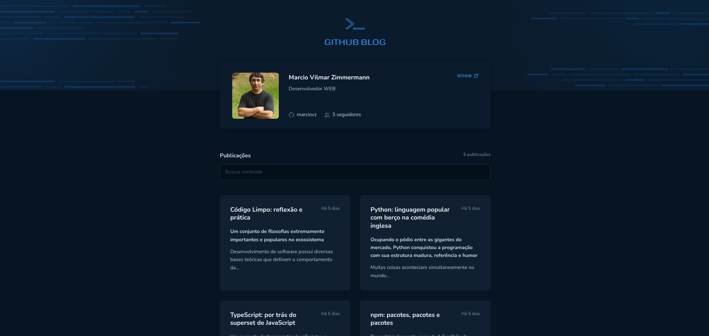
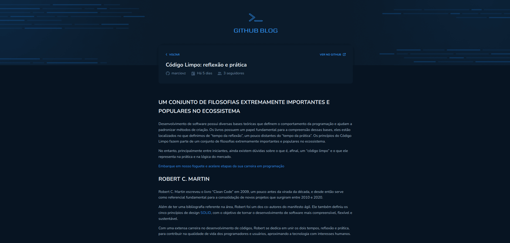

<h1 align="center">github Blog</h1>

## Introdução

O github Blog é uma aplicação WEB de um Blog pessoal que consome postagens armazenadas nas issues do github.

É um projeto de desafio para aplicar os conceitos sobre Reactjs abordados no módulo 3 do curso de Reactjs ignite 2022 ministrado pela Rocketseat.

<div align="center" >
  
  
</div>

## Requisitos

- Nodejs 16.20
- npm 8.19
- Conta no Github
- Repositório com postagens na issue

## Tecnologias

- ReactJS
- Vite
- Typescript
- Style Components
- Context
- Axios
- Icons fontawesome
- Markdown
- date-fns

## Instalação

```sh
# Fazer o clone do projeto em uma máquina local
git clone https://github.com/marciovz/github-blog-reactjs-ignite2022.git
```

```sh
# Acessa a pasta do projeto
cd github-blog-reactjs-ignite2022
```

```sh
# Rodar a instalação das dependências do projeto
npm install
```

## Rodando a aplicação

```sh
# Rodar a aplicação localmente
npm run dev
```

Abrir a aplicação no navegador no endereço http://localhost:3000


## Melhorias

- Aplicar testes
- Fazer o layout Responsivo
- Fazer uma função para selecionar apenas parágrafos, descartando titulos, imagens e links ao mostrar resumo do conteúdo na listagem de posts da página blog


